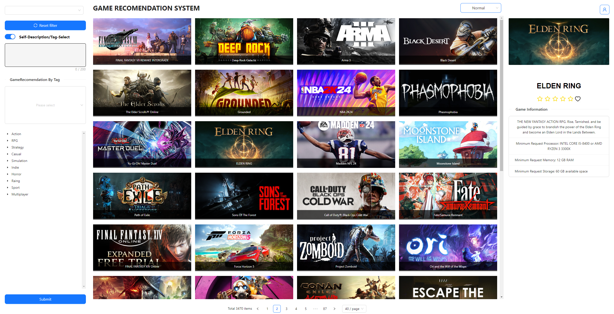

## SECTION 1 : PROJECT TITLE
## A game recommendation system

---

## SECTION 2 : EXECUTIVE SUMMARY
The gaming industry is witnessing an exponential growth in the number and diversity of available games. With this abundance of options, players often find it challenging to navigate through the vast catalog of games and identify those that align with their preferences. Players are faced with an overwhelming amount of game-related information, including game descriptions, reviews, and ratings. Navigating through this flood of information to make informed decisions becomes time-consuming and cumbersome. To address these, there is a need for an intelligent game recommendation system that can alleviate information overload, provide personalized recommendations, facilitate game exploration, and optimize the search process.

This project focuses on implementing a game recommendation system based on a dataset consisting of over 4,000 popular games. The system incorporates two main recommendation techniques: description-based recommendation and tags recommendation. The description-based recommendation approach utilizes natural language processing (NLP) techniques to extract relevant information from game descriptions. By analysing the textual content, the system identifies similarities between games and recommends titles that share similar themes, genres. In addition to description-based recommendation, the system also incorporates tag recommendation. Tags are descriptive labels associated with games that provide additional information about their characteristics. By analysing the tags assigned to each game in the dataset, the system can identify games with similar tags and recommend them to users based on their preferences. Overall, this project combines various technologies, including JavaScript, CSS, HTML, React framework, and Flask lightweight framework, to develop this robust game recommendation system.

---

## SECTION 3 : CREDITS / PROJECT CONTRIBUTION

| Official Full Name  | Student ID (MTech Applicable)  | Work Items (Who Did What) | Email (Optional) |
| :------------ |:---------------:| :-----| :-----|
| Deng Yuxuan | A0285746M | Overall system architecture, Fontend and backend Api| e1221558@u.nus.edu |
| Fu Chentao | A0285737M | Back-end Development, Viedo| e1221549@u.nus.edu |
| Lin Fanzhi | A0285725U | Recommendation based on user description, Database| e1221537@u.nus.edu |
| Tu Runzhang | A0285767H | Recommendation based on item, Rank Algorithm, Database| e1221579@u.nus.edu |

---

## SECTION 4 : VIDEO OF SYSTEM MODELLING & USE CASE DEMO
### Video1: System Design Video

### Video2: Use Case Video;

## SECTION 5 : USER GUIDE

`Refer to the pdf file at Github Folder: UserGuide`

## SECTION 6 : PROJECT REPORT / PAPER

`Refer to project report at Github Folder: Report`

## SECTION 7 : MISCELLANEOUS

`Refer to Github Folder: Miscellaneous`
- cover.jpeg: The Image of Webpage

